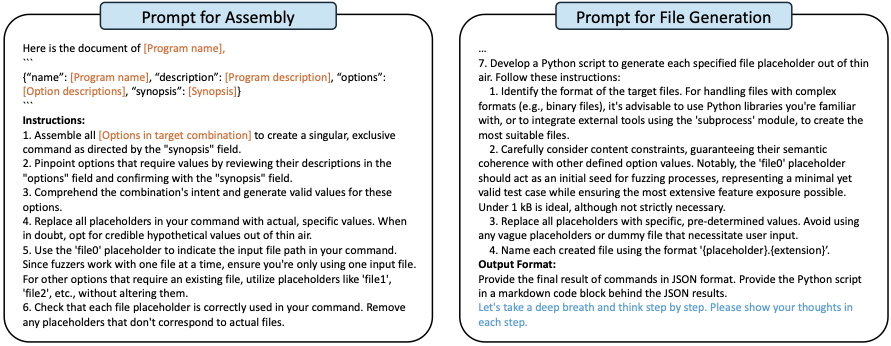

# Appendix

## Appendix A: Prompts for Code Assembly

Figure 6 shows the prompt for code assembly.

**Figure 6: Prompts for assembly and file generation. The content enclosed in brackets denotes the need for specific input.**

## Appendix B: Recall for 20 Randomly Selected Programs

Table 6 shows the precision and recall for Constraint Extraction by ProphetFuzz, CarpetFuzz, and ProphetFuzz𝑁𝑆𝐶 from Documentation of 20 Randomly Selected Programs.

**Table 6: Precision (*Prec.*) and Recall (*Rec.*) for Constraint Extraction by ProphetFuzz, CarpetFuzz, and ProphetFuzz𝑁𝑆𝐶 from Documentation of 20 Randomly Selected Programs.**
<table>
    <tr>
        <th rowspan="2"><b>Program</b></th>
        <th colspan="2"><b>ProphetFuzz</b></th>
        <th colspan="2"><b>CarpetFuzz</b></th>
        <th colspan="2"><b>ProphetFuzzNSC</b></th>
    </tr>
    <tr>
        <th>Prec.</th>
        <th>Rec.</th>
        <th>Prec.</th>
        <th>Rec.</th>
        <th>Prec.</th>
        <th>Rec.</th>
    </tr>
    <tr>
        <td>cjpeg</td>
        <td>100.0%</td>
        <td>80.0%</td>
        <td>50.0%</td>
        <td>40.0%</td>
        <td>2.1%</td>
        <td>100.0%</td>
    </tr>
    <tr>
        <td>cmark</td>
        <td>100.0%</td>
        <td>50.0%</td>
        <td>100.0%</td>
        <td>50.0%</td>
        <td>11.1%</td>
        <td>100.0%</td>
    </tr> 
    <tr>
        <td>djpeg</td>
        <td>100.0%</td>
        <td>74.3%</td>
        <td>95.5%</td>
        <td>60.0%</td>
        <td>7.3%</td>
        <td>77.1%</td>
    </tr> 
    <tr>
        <td>exiv2</td>
        <td>100.0%</td>
        <td>80.0%</td>
        <td>50.0%</td>
        <td>20.0%</td>
        <td>8.5%</td>
        <td>80.0%</td>
    </tr> 
    <tr>
        <td>gif2png</td>
        <td>100.0%</td>
        <td>100.0%</td>
        <td>0.0%</td>
        <td>0.0%</td>
        <td>1.4%</td>
        <td>100.0%</td>
    </tr> 
    <tr>
        <td>img2sixel</td>
        <td>87.5%</td>
        <td>87.5%</td>
        <td>100.0%</td>
        <td>62.5%</td>
        <td>9.2%</td>
        <td>100.0%</td>
    </tr> 
    <tr>
        <td>lrzip</td>
        <td>100.0%</td>
        <td>100.0%</td>
        <td>100.0%</td>
        <td>41.2%</td>
        <td>7.6%</td>
        <td>100.0%</td>
    </tr> 
    <tr>
        <td>openssl-asn1parse</td>
        <td>100.0%</td>
        <td>25.0%</td>
        <td>100.0%</td>
        <td>50.0%</td>
        <td>4.0%</td>
        <td>100.0%</td>
    </tr> 
    <tr>
        <td>openssl-ec</td>
        <td>100.0%</td>
        <td>100.0%</td>
        <td>100.0%</td>
        <td>60.0%</td>
        <td>7.5%</td>
        <td>100.0%</td>
    </tr> 
    <tr>
        <td>pdftopng</td>
        <td>100.0%</td>
        <td>50.0%</td>
        <td>20.0%</td>
        <td>50.0%</td>
        <td>66.7%</td>
        <td>100.0%</td>
    </tr> 
    <tr>
        <td>pdftotext</td>
        <td>100.0%</td>
        <td>94.1%</td>
        <td>22.2%</td>
        <td>11.8%</td>
        <td>6.6%</td>
        <td>100.0%</td>
    </tr> 
    <tr>
        <td>podofoencrypt</td>
        <td>100.0%</td>
        <td>100.0%</td>
        <td>100.0%</td>
        <td>33.3%</td>
        <td>14.3%</td>
        <td>100.0%</td>
    </tr> 
    <tr>
        <td>pspp</td>
        <td>100.0%</td>
        <td>77.8%</td>
        <td>0.0%</td>
        <td>0.0%</td>
        <td>11.2%</td>
        <td>100.0%</td>
    </tr> 
    <tr>
        <td>size</td>
        <td>90.0%</td>
        <td>69.2%</td>
        <td>100.0%</td>
        <td>92.3%</td>
        <td>90.9%</td>
        <td>76.9%</td>
    </tr> 
    <tr>
        <td>speexdec</td>
        <td>100.0%</td>
        <td>100.0%</td>
        <td>45.5%</td>
        <td>50.0%</td>
        <td>19.2%</td>
        <td>100.0%</td>
    </tr> 
    <tr>
        <td>tcpprep</td>
        <td>100.0%</td>
        <td>88.9%</td>
        <td>100.0%</td>
        <td>77.8%</td>
        <td>100.0%</td>
        <td>88.9%</td>
    </tr> 
    <tr>
        <td>tiff2ps</td>
        <td>87.5%</td>
        <td>58.3%</td>
        <td>62.5%</td>
        <td>41.7%</td>
        <td>33.3%</td>
        <td>58.3%</td>
    </tr> 
    <tr>
        <td>tiffinfo</td>
        <td>100.0%</td>
        <td>100.0%</td>
        <td>0.0%</td>
        <td>0.0%</td>
        <td>33.3%</td>
        <td>100.0%</td>
    </tr> 
    <tr>
        <td>xmlwf</td>
        <td>100.0%</td>
        <td>70.0%</td>
        <td>0.0%</td>
        <td>0.0%</td>
        <td>8.1%</td>
        <td>100.0%</td>
    </tr> 
    <tr>
        <td>yara</td>
        <td>100.0%</td>
        <td>100.0%</td>
        <td>100.0%</td>
        <td>100.0%</td>
        <td>2.1%</td>
        <td>100.0%</td>
    </tr>
    <tr>
        <td><b>Overall</b></td>
        <td>97.97%</td>
        <td>80.56%</td>
        <td>77.78%</td>
        <td>46.67%</td>
        <td>8.56%</td>
        <td>89.44%</td>
</table>

## Appendix C: Complete List of Predictive Knowledge

The complete list of the extracted 15 pieces of knowledge used by ProphetFuzz to predict high-risk option combinations is as follows:

1. **Resource Management and Limits**. Options that affect resource allocation and limits can lead to vulnerabilities when they conflict with options that increase resource demands, potentially causing resource exhaustion or buffer overflows.
2. **Complex Data Processing**. Combinations of options that lead to complex data processing tasks can increase the risk of vulnerabilities such as memory corruption, especially when involving external data or detailed output formatting.
3. **Output and Format Manipulation**. Options that modify output verbosity or format can lead to vulnerabilities if they result in excessive data being processed or displayed, potentially revealing sensitive information or causing buffer overflows.
4. **Error Handling Modifications**. Options that suppress or alter error handling can hide underlying issues, allowing the program to operate in an unstable state and increasing the risk of vulnerabilities.
5. **Conflicting Operations**. Using options that perform opposing actions can lead to undefined behavior or race conditions, potentially causing the software to enter an unstable state.
6. **Input/Output Handling**. Options that affect how input and output are handled can lead to vulnerabilities if they cause the program to read or write outside of intended memory areas or handle file operations insecurely.
7. **Concurrency and Parallel Processing**. Options that enable multi-threading or parallel processing can introduce vulnerabilities such as race conditions if combined with options that are not thread-safe.
8. **Verbose and Debugging Modes**. Increasing the verbosity of the program's output or enabling debugging modes can inadvertently expose vulnerabilities by providing more data to an attacker or changing the timing and performance characteristics of the application.
9. **Security Thresholds and Protections**. Options that set security thresholds can lead to vulnerabilities when incorrectly configured or combined with complex XML structures, as they may not protect sufficiently or cause legitimate processing to fail.
10. **External Data and Variable Definition**. Allowing external data input or variable definition can lead to vulnerabilities when combined with options that do not properly sanitize or handle this external input.
11. **Transformation and Canonicalization**. Transforming input into detailed or canonical forms can increase the complexity of processing, leading to vulnerabilities due to the increased complexity of the output.
12. **Specialized Processing Modules**. Passing data to specialized processing modules can lead to vulnerabilities if the modules do not properly handle the data, especially when combined with options that modify data handling.
13. **Scan Optimization**. Optimizing scanning for performance can lead to vulnerabilities when it conflicts with thorough scanning required for security, potentially missing critical checks.
14. **Memory-Intensive Operations**. Combining options that are inherently memory-intensive can lead to vulnerabilities, especially if they are not properly optimized for memory usage, potentially resulting in memory leaks or corruption.
15. **Control Flow Alteration**. Changing the program's control flow with certain options can lead to vulnerabilities when combined with extensive processing options, potentially leading to incorrect processing or logic bypass.