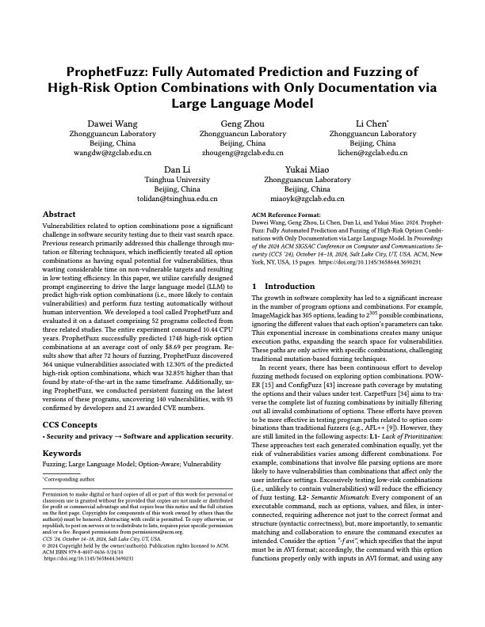

# ProphetFuzz

<p><a href="https://www.usenix.org/system/files/sec23fall-prepub-467-wang-dawei.pdf"></a></p>

The implementation of the paper titled **"ProphetFuzz: Fully Automated Prediction and Fuzzing of High-Risk Option Combinations with Only Documentation via Large Language Model"**

ProphetFuzz is an LLM- based, fully automated fuzzing tool for option combination testing. ProphetFuzz can predict and conduct fuzzing on high-risk option combinations 1 with only documentation, and the entire process operates without manual intervention. 

For more details, please refer to [our paper](https://waugustus.github.io/assets/files/ProphetFuzz.pdf) from ACM CCS'24.

Due to page limitations, the Appendix of the paper could not be included within the main text. Please refer to [Appendix](Appendix.md).

## Structure

```
.
├── Dockerfile
├── README.md
├── assets
│   ├──  dataset
│   │   ├── groundtruth_for_20_programs.json
│   │   └── precision.json
│   └── images
├── fuzzing_handler
│   ├── cmd_fixer.py
│   ├── code_checker.py
│   ├── config.json
│   ├── run_cmin.py
│   ├── run_fuzzing.sh
│   └── utils
│       ├── analysis_util.py
│       ├── code_utils.py
│       └── execution_util.py
├── llm_interface
│   ├── assemble.py
│   ├── config
│   │   └── .env
│   ├── constraint.py
│   ├── few-shot
│   │   ├── manpage_htmldoc.json
│   │   ├── manpage_jbig2.json
│   │   ├── manpage_jhead.json
│   │   ├── manpage_makeswf.json
│   │   ├── manpage_mp4box.json
│   │   ├── manpage_opj_compress.json
│   │   ├── manpage_pdf2swf.json
│   │   └── manpage_yasm.json
│   ├── few-shot_generate.py
│   ├── input
│   ├── output
│   ├── predict.py
│   ├── restruct_manpage.py
│   └── utils
│       ├── gpt_utils.py
│       └── opt_utils.py
├── manpage_parser
│   ├── input
│   ├── output
│   ├── parser.py
│   └── utils
│       └── groff_utils.py
└── run_all_in_one.sh
```

1. manpage_parser: Scripts for parsing documentation
2. llm_interface: Scripts for extracting constraints, predicting high-risk option combinations, and assembling commands.
3. fuzzing_handler: Scripts for preparing and conducting fuzzing.
4. assets/dataset: Dataset for eveluating constraint extraction module.
5. run_all_in_one.sh: Scripts for completing everything with one script.
6. Dockerfile: Building our experiment environment (Tested on Ubuntu 20.04)

The implementations for various components of ProphetFuzz can be found in the following functions,

| Section | Component | File | Function |
|----|----|----|----|
| 3.2 | Constraint Extraction | [llm_interface/constraint.py](llm_interface/constraint.py) | extractRelationships |
| 3.2 | Self Check | [llm_interface/constraint.py](llm_interface/constraint.py) |  checkRelationships |
| 3.3 | AutoCoT | [llm_interface/few-shot_generate.py](llm_interface/few-shot_generate.py) | generatePrompt |
| 3.3 | High-Risk Combination Prediction | [llm_interface/predict.py](llm_interface/predict.py)| predictCombinations |
| 3.4 | Command Assembly | [llm_interface/assembly.py](llm_interface/assembly.py) | generateCommands |
| 3.5 | File Generation | [fuzzing_handler/generate_combination.py](scripts/generate_combination.py) | main |
| 3.5 | Corpus Minimization | [fuzzing_handler/run_cmin.py](scripts/run_cmin.py) | runCMinCommands |
| 3.5 | Fuzzing | [fuzzing_handler/run_fuzzing.sh](fuzzing_handler/run_fuzzing.sh) | runFuzzing |

## Usage Example

Here's the English translation:

1. **Using Docker to Configure the Running Environment**

   - If you only want to complete the part that interacts with the LLM, you can directly use our pre-installed image (4GB):

   ```
   docker run -it 4ugustus/prophetfuzz_base bash
   ```

   - If you want to complete the entire process, including seed generation, command repair, and fuzzing, please build the full image based on the pre-installed image:

   ```
   docker build -t prophetfuzz:latest .
   docker run -it --privileged=true prophetfuzz bash
   # 'privileged' is used for setting up the fuzzing environment
   ```

2. **Set Up Your API Key**:
   Set your OpenAI API key in the `llm_interface/config/.env` file:
   ```bash
   OPENAI_API_KEY="[Input Your API Key Here]"
   ```

2. **Run the Script**:
   Execute the script to start the automated fuzzing process:
   
   ```bash
   bash run_all_in_one.sh bison
   ```

   **Note**: If you are not within our Docker environment, you might need to manually install dependencies and adjust the `fuzzing_handler/config.json` file to specify the path to the program under test.

   If you prefer to start fuzzing manually, use the following command:

   ```bash
   fuzzer/afl-fuzz -i fuzzing_handler/input/bison -o fuzzing_handler/output/bison_prophet_1 -m none -K fuzzing_handler/argvs/argvs_bison.txt -- path/to/bison/bin/bison @@
   ```

## CVEs Assigned ##

We employ ProphetFuzz to perform persistent fuzzing on the latest versions of the programs in our dataset. To date, ProphetFuzz has uncovered 140 zero-day or half-day vulnerabilities, 93 of which have been confirmed by the developers, earning 21 CVE numbers.

| CVE            | Program   | Type                     |
| -------------- | --------- | ------------------------ |
| CVE-2024-3248  | xpdf      | stack-buffer-overflow    |
| CVE-2024-4853  | editcap   | heap-buffer-overflow     |
| CVE-2024-4855  | editcap   | bad free                 |
| CVE-2024-31744 | jasper    | assertion failure        |
| CVE-2024-31745 | dwarfdump | use-after-free           |
| CVE-2024-31746 | objdump   | heap-buffer-overflow     |
| CVE-2024-32154 | ffmpeg    | segmentation violation   |
| CVE-2024-32157 | mupdf     | segmentation violation   |
| CVE-2024-32158 | mupdf     | negative-size-param      |
| CVE-2024-34960 | ffmpeg    | floating point exception |
| CVE-2024-34961 | pspp      | segmentation violation   |
| CVE-2024-34962 | pspp      | segmentation violation   |
| CVE-2024-34963 | pspp      | assertion failure        |
| CVE-2024-34965 | pspp      | assertion failure        |
| CVE-2024-34966 | pspp      | assertion failure        |
| CVE-2024-34967 | pspp      | assertion failure        |
| CVE-2024-34968 | pspp      | assertion failure        |
| CVE-2024-34969 | pspp      | segmentation violation   |
| CVE-2024-34971 | pspp      | segmentation violation   |
| CVE-2024-34972 | pspp      | assertion failure        |
| CVE-2024-35316 | ffmpeg    | segmentation violation   |

## Credit ##

Thanks to Dawei Wang ([@4ugustus](https://github.com/waugustus)) and Geng Zhou ([@Arbusz](https://github.com/Arbusz)) for their valuable contributions to this project.

## Citing this paper ##

In case you would like to cite ProphetFuzz, you may use the following BibTex entry:

```
@inproceedings {
  title = {ProphetFuzz: Fully Automated Prediction and Fuzzing of High-Risk Option Combinations with Only Documentation via Large Language Model},
  author = {Wang, Dawei and Zhou, Geng and Chen, Li and Li, Dan and Miao, Yukai},
  booktitle = {Proceedings of the 2024 ACM SIGSAC Conference on Computer and Communications Security},
  publisher = {Association for Computing Machinery},
  address = {Salt Lake City, UT, USA},
  pages = {},
  year = {2024}
}
```